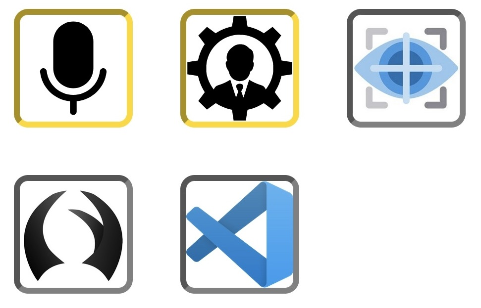

# Talon Deck

[Stream deck](https://www.elgato.com/en/stream-deck) inspired interactive dashboard for [Talon Voice](https://talonvoice.com)

Exposes a responsive webpage where the user can monitor and control Talon.

## Installation and running

1. Install [`talon_deck.py`](https://github.com/AndreasArvidsson/andreas-talon/blob/master/misc/talon_deck.py) in the Talon user directory.  
   _Some of the data gathering `user.` actions may be lacking from your system_
1. Install dependencies for node server  
   `npm install`
1. Build node server  
   `npm run build`
1. Start node server  
   `npm start`

## Implementation details

1. `talon_deck.py` in the Talon user directory keeps track of changing states in Talon and updates a JSON file in the systems temp directory.
1. The node server watches for changes in the JSON file and via web sockets updates the webpage.
1. On every update the Talon actions gets converted into UUID `actionId` that are sent to the webpage. The Talon actions never leave the server and the `actionId` becomes invalid after each update.
1. When the user presses the icon the `actionId` is sent to the server, converted back to the Talon action and piped into the Talon repl.
